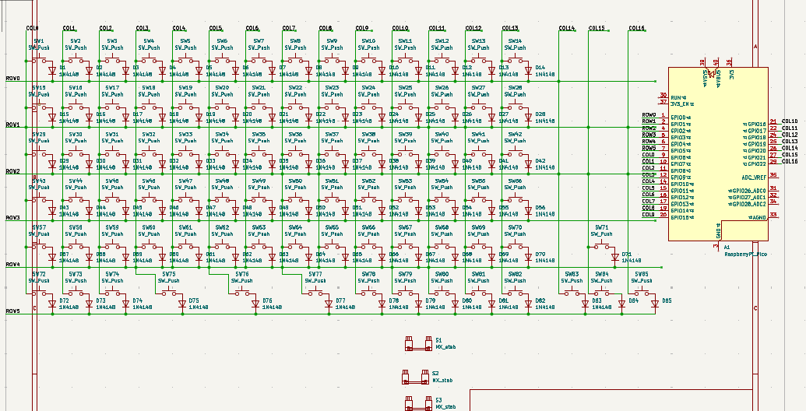

# Keeb Build Journal
## July 15th 2026, 3 hrs work
I worked on my schematic for the Keeb project and since it is new to me, did not make much progress and only got 
almost 3 rows done, will complete more tommorow.

## July 16th 2026 2:53 PM- 2 hrs work
I worked on the schematic and made some progress, will work on more later in the day and finish.

## July 16th 2026 7:13 PM - 3 hrs work
I finished the schematic, completely, and wired it to the Raspberry Pi Pico.

